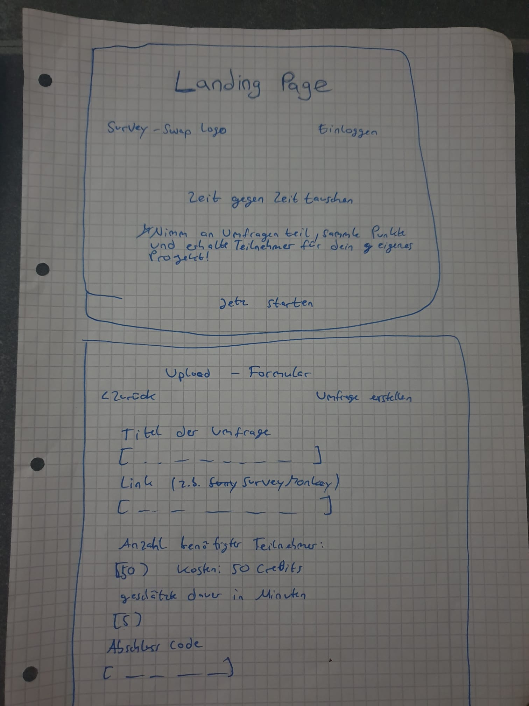
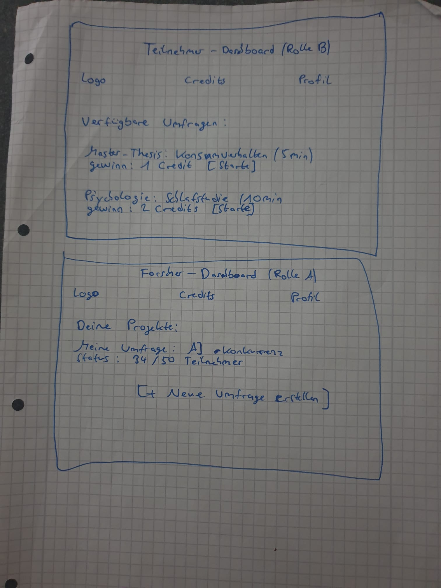

{: .no_toc }
# Value Proposition

Table of contents

+ ToC
{: toc }
{: .text-delta }

## The Problem

Es is extrem schwierig, fremde Personen dazu zu bewegen, kostenlos an Umfragen teilzunehmen, da oft die Zeit und Motivation fehlen.

## Our Solution

Ein "Geben und Nehmen"-Prinzip, Die App fungiert als Marktplatz, auf dem Zeit gegen Zeit getauscht wird, verwaltet durch ein credit-system.

**Plattform-Logik (Two-sided Platform):**
* **Rolle A (Forscher):** Erstellt Umfragen und "bezahlt" Credits, um Teilnehmer zu gewinnen.
*  **Rolle B (Teilnehmer):** Nimmt an Umfragen teil, validiert dies über einen Code undverdient dadurch Credits für eigene Vorhaben.

## Target User(s)

Studierende, die auf ihre Abschlussarbeiten dringed Teilnehmer für Umfragen suchen.

##  Happy Path

[Illustrate the app "happy path", from the app's entry point to a completed task. You might want to show the path as (schematic) screen flows. Ensure that your "happy path" (a) is consistent with the Value Proposition, and (b) shows the features as implemented in the submitted web app.]

---

## Target Scope

Hier sind die ersten Skizzen, die den Ablauf der App visualisieren:

### Landing Page § Umfrage-Upload

### Teilnehmer- § Forscher Dashboards
